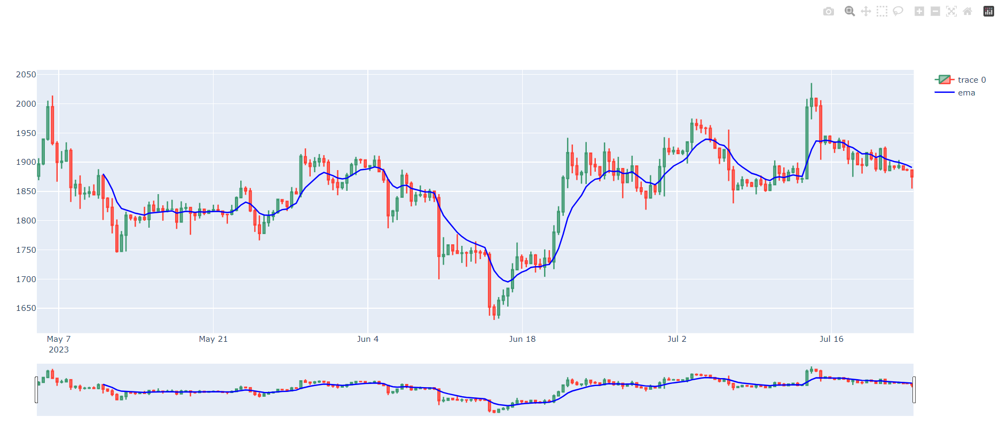

# test task
A cadlestick chart with ema.

to run install dependences, if needed:
```
pip install -r requirements.txt
```
then use 
```
pytnon3 price_chart.py
```
then you should see smth like that in your brouser:


to run tests:
```
pytnon3 unittests.py
```
